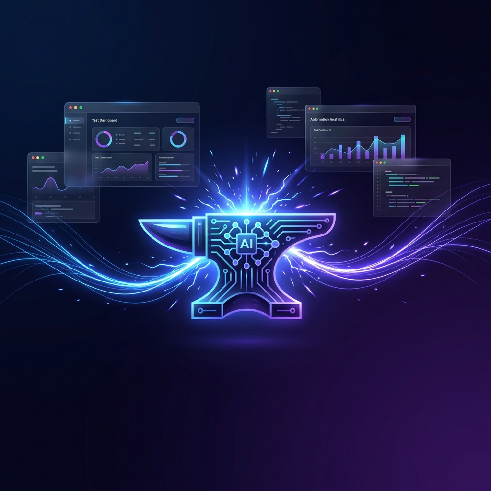
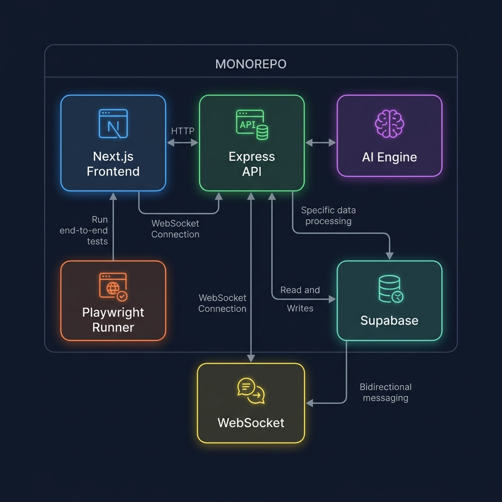
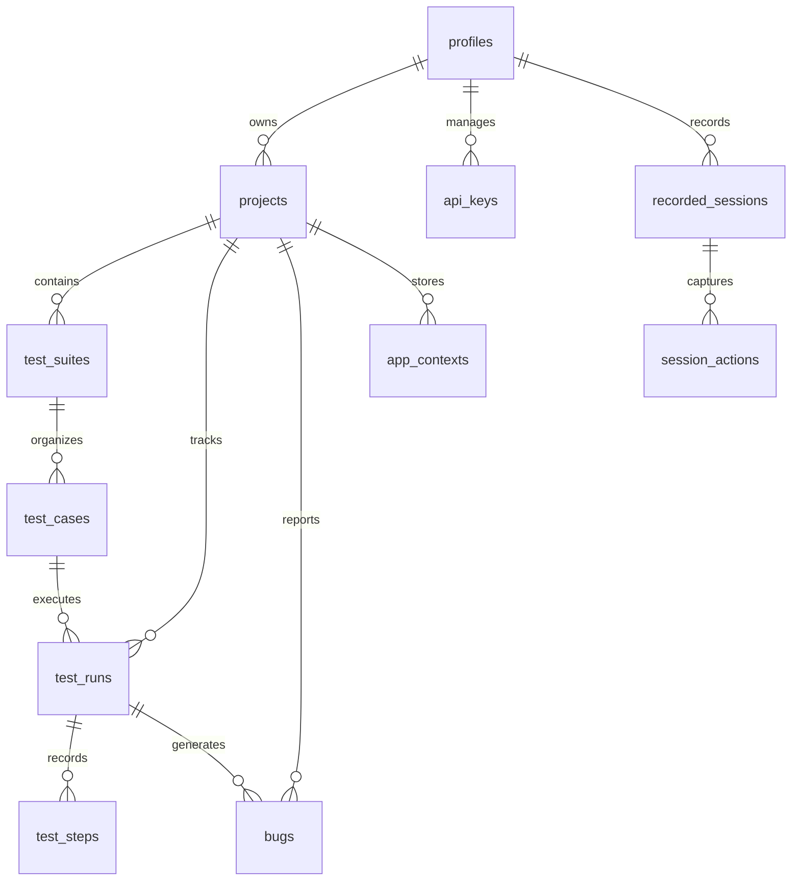

<div align="center">



<br />

# ⚡ QA Forge

### **The AI-Powered Test Automation Platform That Thinks Like a QA Engineer**

[](LICENSE)
[](https://www.typescriptlang.org/)
[](https://nextjs.org/)
[](https://playwright.dev/)
[](https://supabase.com/)
[](https://turbo.build/)

<br />

**Describe your tests in plain English. Let AI generate them. Watch Playwright execute them — live.**

[🎬 Live Demo](#-live-demo) · [🚀 Quick Start](#-quick-start) · [✨ Features](#-features) · [🏗️ Architecture](#️-architecture) · [📦 Packages](#-monorepo-packages) · [🗺️ Roadmap](#️-roadmap)

<br />

---

</div>

<br />

## 🎬 Live Demo

> **No signup. No setup. Click and explore.**

QA Forge ships with a public **read-only demo** that auto-signs you into a fully seeded account — three projects, real test suites and cases, and completed test runs you can replay step-by-step in the live streaming terminal.

| | |
|---|---|
| **Demo link** | `/demo` (auto-signs in as the read-only demo account) |
| **What you'll see** | Seeded projects → test suites → cases → **replay a run live** in the violet-glow terminal with a per-step screenshot filmstrip + auto-filed bugs |
| **Locally** | `pnpm dev`, then open [`http://localhost:3000/demo`](http://localhost:3000/demo) |
| **Hosted** | _Add your Vercel URL here once deployed — see [`artifacts/01-Production-Deployment-Guide.md`](artifacts/01-Production-Deployment-Guide.md)_ |

Demo mode is **read-only at two layers** — an API guard blocks every mutating verb, and restrictive RLS policies block direct database writes — so the sandbox stays pristine no matter who's clicking. Want to create your own projects and run real AI generation? [Sign up](#-quick-start) and add a provider key in **Settings → API Keys**.

<br />

---

<br />

## 🎬 The Problem

> **Manual test writing is slow.** Manual test execution is slower. Managing test suites across sprints is a nightmare. What if your QA platform could _understand_ your app and write the tests for you?

Traditional QA tools force you into rigid frameworks, brittle record-and-replay wizards, or mountains of boilerplate code. **QA Forge takes a fundamentally different approach.**

<br />

## ✨ Features

<table>
<tr>
<td width="50%">

### 🧠 AI-Powered Test Generation
Tell QA Forge what to test in **plain English**. Our multi-provider AI engine (OpenAI GPT-4o, Anthropic Claude, Google Gemini) generates comprehensive Playwright test cases — complete with selectors, assertions, and edge cases.

```
"Test the login flow with valid credentials,
 invalid password, and empty fields"
```
→ **6 test cases generated in seconds**

</td>
<td width="50%">

### 🎭 Live Browser Execution
Watch your tests execute in **real-time** via WebSocket streaming. Every click, every assertion, every screenshot — streamed to your dashboard as it happens. No more waiting for CI pipelines to tell you what broke.

- 🖥️ Chromium / Firefox / WebKit
- 📸 Step-by-step screenshots
- ⏱️ Per-step timing metrics

</td>
</tr>
<tr>
<td width="50%">

### 🐛 Auto Bug Detection
When tests fail, QA Forge **automatically creates bug reports** with:
- Exact failure step & error message
- Screenshot of the failure state
- Browser & environment context
- Linked to the originating test run

*Zero manual triage needed.*

</td>
<td width="50%">

### 🔐 Enterprise-Grade Security
- **AES-256-GCM** encryption for all API keys (unique IV per encryption)
- **Row-Level Security** on every database table
- **JWT authentication** with live token validation on every request
- **Rate limiting** (100 req/min global, 10 req/min AI routes)
- API keys validated against provider health endpoints

</td>
</tr>
<tr>
<td width="50%">

### 📊 Project Management
Organize your testing with a **full project hierarchy**:
- 📁 Projects with base URL configuration
- 📋 Test Suites (one-level hierarchy)
- 🧪 Test Cases with priority & tagging
- 📈 Run history with aggregated pass/fail stats

</td>
<td width="50%">

### ⚡ Real-Time Everything
Built on **Socket.io** for instant feedback:
- `test:step:start` — Step execution begins
- `test:step:complete` — Step result with screenshot
- `test:screenshot` — Live base64 screenshot stream
- `test:bug_created` — Auto-bug notification
- `test:complete` — Final run summary

</td>
</tr>
</table>

<br />

## 🏗️ Architecture

<div align="center">

</div>

<br />

QA Forge is built as a **pnpm + Turborepo monorepo** — every component is a first-class TypeScript package with strict type safety across boundaries.

```
qaforge/
├── apps/
│   ├── web/                    # Next.js 15 App Router — Dashboard & Auth
│   └── api/                    # Express.js — REST API & WebSocket Server
├── packages/
│   ├── ai-engine/              # Multi-provider AI test case generation
│   ├── playwright-runner/      # Headless browser test execution engine
│   ├── shared-types/           # Shared Zod schemas, DTOs & TypeScript types
│   ├── export-engine/          # Test report export (Coming Soon)
│   └── integrations/           # Jira, GitHub, Slack (Coming Soon)
├── supabase/
│   ├── migrations/             # 20 PostgreSQL migration files
│   ├── seed.sql                # Development seed data
│   └── config.toml             # Local Supabase configuration
└── turbo.json                  # Turborepo pipeline configuration
```

<br />

## 📦 Monorepo Packages

| Package | Description | Key Tech |
|:--------|:------------|:---------|
| **`@qaforge/web`** | Next.js 15 dashboard with SSR auth, project management, live test monitoring, and settings | Next.js, React 18, Tailwind CSS, Supabase SSR, Socket.io Client |
| **`@qaforge/api`** | Express REST API with JWT auth, Zod validation, AES encryption, WebSocket orchestration | Express, Zod, Winston, Socket.io, AES-256-GCM |
| **`@qaforge/ai-engine`** | Multi-provider AI client for test case generation from natural language prompts | OpenAI GPT-4o, Claude Haiku, Gemini 2.0 Flash |
| **`@qaforge/playwright-runner`** | Headless browser automation engine with keyword-to-Playwright instruction mapping | Playwright (Chromium, Firefox, WebKit) |
| **`@qaforge/shared-types`** | Single source of truth for TypeScript interfaces, enums, DTOs, and WebSocket event types | TypeScript, Zod |
| **`@qaforge/export-engine`** | Test report export engine *(MVP-3)* | — |
| **`@qaforge/integrations`** | External service connectors *(MVP-3)* | Jira, GitHub, Slack |

<br />

## 🚀 Quick Start

### Prerequisites

| Tool | Version | Purpose |
|:-----|:--------|:--------|
| **Node.js** | `≥ 18.x` | Runtime |
| **pnpm** | `≥ 9.15` | Package manager |
| **Docker** | Latest | Supabase local dev |
| **Supabase CLI** | `≥ 2.x` | Database management |

### 1️⃣ Clone & Install

```bash
git clone https://github.com/your-org/qa-forge.git
cd qa-forge
pnpm install
```

### 2️⃣ Configure Environment

```bash
cp .env.example .env
```

```env
# Supabase (populated by `supabase start`)
NEXT_PUBLIC_SUPABASE_URL=http://localhost:54321
NEXT_PUBLIC_SUPABASE_ANON_KEY=<your-anon-key>
SUPABASE_SERVICE_ROLE_KEY=<your-service-role-key>

# API
NEXT_PUBLIC_API_URL=http://localhost:4000
PORT=4000
NODE_ENV=development

# Security (generate a 64-char hex string)
ENCRYPTION_KEY=$(openssl rand -hex 32)
JWT_SECRET=<your-supabase-jwt-secret>
```

### 3️⃣ Start Supabase

```bash
npx supabase start       # Spins up local Supabase (PostgreSQL + Auth + Storage)
npx supabase db reset     # Applies all 20 migrations + seed data
```

### 4️⃣ Launch Development

```bash
pnpm dev                  # Starts both apps via Turborepo
```

| Service | URL |
|:--------|:----|
| 🌐 **Web Dashboard** | [`http://localhost:3000`](http://localhost:3000) |
| 🔌 **REST API** | [`http://localhost:4000/api/health`](http://localhost:4000/api/health) |
| 🗄️ **Supabase Studio** | [`http://localhost:54323`](http://localhost:54323) |
| 📡 **WebSocket** | `ws://localhost:4000` |

<br />

## 🗄️ Database Schema

**15 tables** secured with Row-Level Security, powered by PostgreSQL + pgvector:



<details>
<summary><b>📋 Full Migration List (17 files)</b></summary>

| # | Migration | Creates |
|:--|:----------|:--------|
| 1 | `enable_extensions` | `uuid-ossp`, `pgvector`, `moddatetime` |
| 2 | `create_profiles` | User profiles + auto-creation trigger |
| 3 | `create_api_keys` | Encrypted AI provider keys |
| 4 | `create_projects` | Project management |
| 5 | `create_test_suites` | Hierarchical test organization |
| 6 | `create_test_cases` | Test definitions with JSONB steps |
| 7 | `create_test_runs` | Execution tracking & status |
| 8 | `create_test_steps` | Per-step execution results |
| 9 | `create_recorded_sessions` | Browser session recordings |
| 10 | `create_session_actions` | Captured user actions |
| 11 | `create_bugs` | Auto-generated bug reports |
| 12 | `create_integrations` | External service configs |
| 13 | `create_export_schemas` | Report export templates |
| 14 | `create_app_contexts` | AI context with vector embeddings |
| 15 | `create_sprint_changes` | Sprint changelog tracking |
| 16 | `create_media_attachments` | Polymorphic media storage |
| 17 | `create_updated_at_triggers` | Automated `updated_at` on 9 tables |

</details>

<br />

## 🛡️ API Reference

### Authentication
All protected routes require a Supabase JWT via `Authorization: Bearer <token>`.

### Core Endpoints

<details>
<summary><b>🏥 Health</b></summary>

| Method | Endpoint | Auth | Description |
|:-------|:---------|:-----|:------------|
| `GET` | `/api/health` | ❌ | Server health + version |

</details>

<details>
<summary><b>👤 Auth & Profile</b></summary>

| Method | Endpoint | Auth | Description |
|:-------|:---------|:-----|:------------|
| `GET` | `/api/auth/me` | ✅ | Get current user profile |
| `PUT` | `/api/auth/me` | ✅ | Update profile (`full_name`, `avatar_url`) |

</details>

<details>
<summary><b>📁 Projects</b></summary>

| Method | Endpoint | Auth | Description |
|:-------|:---------|:-----|:------------|
| `GET` | `/api/projects` | ✅ | List user's projects |
| `POST` | `/api/projects` | ✅ | Create project |
| `GET` | `/api/projects/:id` | ✅ | Get project + run stats |
| `PUT` | `/api/projects/:id` | ✅ | Update project |
| `DELETE` | `/api/projects/:id` | ✅ | Delete project (cascades) |

</details>

<details>
<summary><b>🔑 API Keys</b></summary>

| Method | Endpoint | Auth | Description |
|:-------|:---------|:-----|:------------|
| `GET` | `/api/api-keys` | ✅ | List keys (never exposes encrypted values) |
| `POST` | `/api/api-keys` | ✅ | Add AI provider key (AES-256-GCM encrypted) |
| `PUT` | `/api/api-keys/:id` | ✅ | Update key |
| `DELETE` | `/api/api-keys/:id` | ✅ | Revoke key |
| `POST` | `/api/api-keys/:id/validate` | ✅ | Live-validate against provider API |

</details>

<details>
<summary><b>📋 Test Suites & Cases</b></summary>

| Method | Endpoint | Auth | Description |
|:-------|:---------|:-----|:------------|
| `GET` | `/api/projects/:pid/test-suites` | ✅ | List suites |
| `POST` | `/api/projects/:pid/test-suites` | ✅ | Create suite |
| `GET` | `/api/projects/:pid/test-suites/:sid/test-cases` | ✅ | List test cases in suite |
| `POST` | `/api/projects/:pid/test-suites/:sid/test-cases` | ✅ | Create test case |

</details>

<details>
<summary><b>▶️ Test Runs</b></summary>

| Method | Endpoint | Auth | Description |
|:-------|:---------|:-----|:------------|
| `GET` | `/api/projects/:pid/test-runs` | ✅ | List runs |
| `POST` | `/api/projects/:pid/test-runs` | ✅ | Create & auto-execute run |
| `GET` | `/api/projects/:pid/test-runs/:rid` | ✅ | Get run details + steps |

</details>

<details>
<summary><b>🤖 AI Generation</b></summary>

| Method | Endpoint | Auth | Description |
|:-------|:---------|:-----|:------------|
| `POST` | `/api/projects/:pid/ai/generate` | ✅ | Generate test cases from NL prompt |

</details>

<details>
<summary><b>🐛 Bugs</b></summary>

| Method | Endpoint | Auth | Description |
|:-------|:---------|:-----|:------------|
| `GET` | `/api/projects/:pid/bugs` | ✅ | List auto-detected bugs |
| `PUT` | `/api/projects/:pid/bugs/:bid` | ✅ | Update bug status/severity |

</details>

<br />

## 📡 WebSocket Events

Real-time test execution telemetry via Socket.io:

```typescript
// Connect with JWT auth
const socket = io('ws://localhost:4000', {
  auth: { token: 'your-supabase-jwt' }
});

// Subscribe to a test run
socket.emit('test:join', { test_run_id: 'uuid' });

// Listen to live execution events
socket.on('test:running',       (data) => { /* Run started */ });
socket.on('test:step:start',    (data) => { /* Step N begins */ });
socket.on('test:step:complete', (data) => { /* Step result + screenshot URL */ });
socket.on('test:screenshot',    (data) => { /* Live base64 screenshot */ });
socket.on('test:complete',      (data) => { /* Final pass/fail verdict */ });
socket.on('test:bug_created',   (data) => { /* Auto-bug notification */ });
socket.on('test:error',         (data) => { /* Execution error */ });
```

<br />

## 🗺️ Roadmap

<table>
<tr>
<td>

### ✅ MVP-1 — Foundation
*Completed*

- [x] Monorepo setup (pnpm + Turborepo)
- [x] 20 PostgreSQL migrations + RLS
- [x] Express API with JWT auth
- [x] AES-256-GCM key encryption
- [x] Next.js dashboard with SSR auth
- [x] Projects CRUD & API key management
- [x] Profile settings

</td>
<td>

### ✅ MVP-2 — AI & Execution
*Completed*

- [x] Multi-provider AI engine (GPT-4o, Claude, Gemini)
- [x] NL → Playwright test generation
- [x] Live browser test execution
- [x] WebSocket real-time streaming
- [x] Auto bug creation on failure
- [x] Test suite & case management
- [x] Run detail live monitoring

</td>
</tr>
<tr>
<td>

### 🔜 MVP-3 — Intelligence
*Coming Soon*

- [ ] Session recording & replay
- [ ] App context with vector embeddings
- [ ] Sprint change impact analysis
- [ ] Export engine (PDF, CSV, JSON)
- [ ] Visual regression detection

</td>
<td>

### 🔮 MVP-4 — Integrations
*Planned*

- [ ] Jira issue sync
- [ ] GitHub Actions integration
- [ ] Slack notifications
- [ ] CI/CD pipeline triggers
- [ ] Team collaboration & RBAC

</td>
</tr>
</table>

<br />

## 🧰 Tech Stack

<div align="center">

| Layer | Technology | Why |
|:------|:-----------|:----|
| **Frontend** | Next.js 15 + React 18 + Tailwind CSS | SSR auth, App Router, rapid UI |
| **Backend** | Express.js + TypeScript | Battle-tested, WebSocket-native |
| **AI** | OpenAI / Anthropic / Google AI | Multi-provider flexibility |
| **Browser Engine** | Playwright | Cross-browser automation |
| **Database** | PostgreSQL + pgvector | Relational data + AI embeddings |
| **Auth & Storage** | Supabase | Auth, RLS, file storage |
| **Real-Time** | Socket.io | Bidirectional event streaming |
| **Monorepo** | pnpm + Turborepo | Parallel builds, shared types |
| **Validation** | Zod | Runtime type safety |
| **Encryption** | AES-256-GCM | NIST-approved, authenticated encryption |
| **Logging** | Winston | Structured logging with level control |

</div>

<br />

## 🤝 Contributing

We welcome contributions! Please see our development workflow:

```bash
# Build all packages
pnpm build

# Type-check entire monorepo
pnpm type-check

# Lint everything
pnpm lint

# Format code
pnpm format
```

> **Important:** Always build `@qaforge/shared-types` first when making type changes:
> ```bash
> pnpm --filter @qaforge/shared-types build
> ```

<br />

## 📄 License

This project is proprietary software. All rights reserved.

<br />

---

<div align="center">

<br />

**Built with 🔥 by [SYED](https://github.com/S-YED)**

*Forging quality, one test at a time.*

<br />

⭐ **Star this repo** if QA Forge sparks your interest!

<br />

</div>
